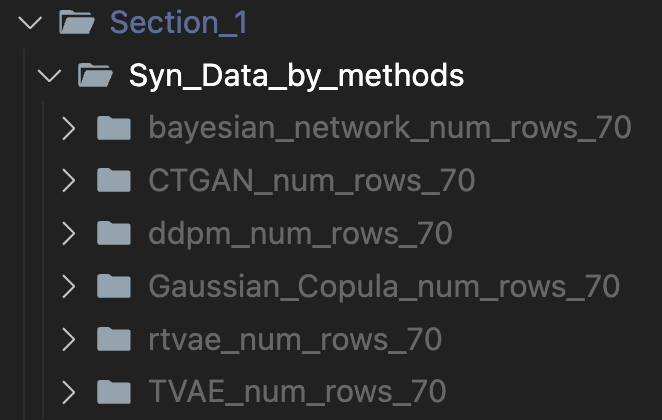

# Enhanced QTc Interval Monitoring in the CSICU: Evaluating the Impact of Synthetic Data and Machine Learning Techniques

This GitHub repository contains the code and resources for reproducing the experiments conducted in the study "Enhanced QTc Interval Monitoring in the CSICU: Evaluating the Impact of Synthetic Data and Machine Learning Techniques."

## Objectives

The repository aims to provide a comprehensive and reproducible framework for:

1. Evaluating and selecting the best-performing synthetic data generation techniques
2. Comparing the performance of machine learning models trained on:
   a) The original data
   b) The selected synthetic data
   c) Combined data (original and synthetic)

## Note on Reproducibility

It's important to note that due to the stochastic nature of the synthetic data generation methods used in this study, exact replication of results may be difficult. However, researchers and practitioners can use this repository to approximate the study's findings and observe similar trends.

# Set up conda environment

```bash
conda env create -f environment.yml
conda activate qtc_reproduction_env_py_3.10
```

# Section 1: Find the best synthetic data generator based on the metrics

- Please use this google drive [link](https://drive.google.com/drive/folders/1x4E2VXSZmM7Nfsf7HKkeDOaRocCo52Z8?usp=drive_link) to use the colab notebooks. There are two folders in the google drive link: `Sec_1_Find_Best_SYN_Data_Gen_Method` and `Sec_2_Gen_SYN_Data_for_ML_task`. Each folder contains the colab notebooks for generating synthetic data using different methods.
  

- In Google Drive, in the `Sec_1_Find_Best_SYN_Data_Gen_Method`folder:

  - Open the `SDV_Synthesize_a_table_(GC_CTGAN_TVAE)_QTc_replacement_sampling.ipynb` file.
  - Run `SDV_Synthesize_a_table_(GC_CTGAN_TVAE)_QTc_replacement_sampling.ipynb`

  - Generate synthetic data using each method.
  - Download the generated data (zip files).

    

  - Unzip files and locate them to the `Section_1/Syn_Data_by_methods` folder on the local repository SYN_DATA_QTc.

    

- In Google Drive, in the `Sec_1_Find_Best_SYN_Data_Gen_Method` folder:

  - Run `Synthcity_Synthesize_a_table_(BN_RTVAE_DDPM)_QTc_replacement_sampling.ipynb`
  - Generate synthetic data using each method.
  - Download the generated data (zip files).
  - Unzip files and locate them to the `Section_1/Syn_Data_by_methods` folder on the local machine.

- Run the `Section_1/Generate_Metrics.py` to generate the metrics of the synthetic data generated by each method, located in the local repository SYN_DATA_QTc.
- Run the `Section_1/draw_Boxplots.py`, located in the local repository SYN_DATA_QTc.
- Run the `Section_1/draw_Tables_CIs.py`, located in the local repository SYN_DATA_QTc.
- Analyze the box plots, tables, and confidence intervals created in the `Section_1/png_files` to select the best synthetic data generator based on the metrics among the methods, located in the local repository SYN_DATA_QTc.

# Section 2: Conduct machine learning experiments

- Comparison of Models Trained on Original Data vs. Synthetic Data

  - Please use this google drive [link](https://drive.google.com/drive/folders/1x4E2VXSZmM7Nfsf7HKkeDOaRocCo52Z8?usp=drive_link) to use the colab notebooks.
  - If the best synthetic data generator is one of BN, RTVAE, or DDPM, then:

    - In Google Drive, in the `Sec_2_Gen_SYN_Data_for_ML_task` folder:
      - Run `Synthcity_Synthesize_a_table_(BN)_QTc_replacement_sampling_ML_task.ipynb`.
    - Download the generated data (zip file) to the `Section_2/Syn_Data_for_ML_task` folder in the local repository SYN_DATA_QTc.
    - Each generated dataset csv will contain an increasing number of data points in increments of 500 (e.g., 500 data points, 1000 data points, etc.), resulting in a total of 10 CSV files.
    - Run Aliro. Please use this [link](https://github.com/HyunjunA/Aliro/tree/qtc_syn_data) to run Aliro.

    - Before running Aliro, you need to modify the choices under the ui key for n_estimators of XGBClassifier in the /Aliro/docker/dbmongo/files/projects.json file. Please refer to the image below.

    

    

    - And in the /Aliro/ai/sklearn/config/classifiers.py file, please create the configuration for XGBClassifier with n_estimators as follows:

    

    

    ```bash
    docker-compose -f docker-compose-wheel-builder.yml up

    docker-compose up
    ```

    - For detailed instructions, please refer to the Aliro [documentation](https://github.com/EpistasisLab/Aliro/blob/master/docs/guides/developerGuide.md#building-docker-images).
    - Upload the original dataset (newz_train.csv) and the synthetic dataset below to Aliro and train the models. After training various models, find the best models for each dataset. Compare models trained on original data vs. synthetic data.
      - DATAPOOL_z_tr/newz_train.csv: The original data.
      - Section_2/Syn_Data_for_ML_task: Please locate the folder containing the synthetic data generated by the best synthetic data generator.
    - Save the pickle files of the best-performing models trained on original data and the best-performing models trained on synthetic data in the `Section_2/Models_pkl` folder in the local repository SYN_DATA_QTc.
    - Create a `test_trained_models_PSB25_Reproduction` folder within the `machine` folder of `Aliro`. Inside the `test_trained_models_PSB25_Reproduction` folder, create a `Models_pkl` folder and move the pickle files to the `Models_pkl` folder and a `DATAPOOL_z_test` folder and move the `newz_test.csv` file to the `DATAPOOL_z_test` folder.

      

    - Additionally, move `test_model_newz_individual_model.py` from the `SYN_DATA_QTc` local repository to the `test_trained_models_PSB25_Reproduction` folder within the machine directory in Aliro.

  - Run the following to evaluate the performance of each model using the test_model_newz_individual_model.py script with each pickle file. Ensure that Aliro is currently running before executing the script. The performance results will be saved in a CSV file.

    ```bash
    docker ps -a
    ```

    You can run the above command to check the container IDs as shown in the image below.

    

    ```bash
    docker exec -it container_id /bin/bash
    ```

    Then, use the container ID of aliro-machine to execute the above command. Here is an example:

    ```bash
    docker exec -it b319dc6f67c2 /bin/bash
    ```

    By doing so, you can enter the aliro-machine container as shown below.

    

    Now, navigate to the test_trained_models_PSB25_Reproduction directory and run the test_model_newz_individual_model.py script.

    ```bash
    cd test_trained_models_PSB25_Reproduction
    ```

    Before running test_model_newz_individual_model.py, you need to assign one of the pickle file names from the Models_pkl folder to the `model_pickle_file` variable. Here is an example:

    ```python
    if __name__ == '__main__':
      print("Python version:", sys.version)
      print("sklearn version", sklearn.__version__)

      model_pickle_file = "model_668564998c68f70031896bd9_RFC_Origin.pkl"


    ```

      <!--  -->

  - Then, run test_model_newz_individual_model.py. Modify the model_pickle_file variable to run the script for each pickle file. The metrics for each model will be saved in the results.csv file.

    

    Move the `results.csv` file to the local repository `SYN_DATA_QTc` and run `fig_5.py` to visualize the results.

  - If the best synthetic data generator is one of GC, CTGAN, or TVAE, then follow the same process as above, but run the `SDV_Synthesize_a_table_(GC)_QTc_replacement_sampling_ML_task.py` file in the `Sec_2_Gen_SYN_Data_for_ML_task` folder in Google Drive.

- Comparison of Models Trained on Original Data vs. Combined Original and Synthetic Data
  - The process is the same as above, with the only difference being that we combine the synthetic data we generated with the original data to train the model.
  - Run comb_origin_syn.py in the `Section_2` folder in the local repository SYN_DATA_QTc, which merges the original data with the synthetic data. The combined data will be saved in the `Section_2/Syn_Data_for_ML_task/Combined_synthetic_data_using_Bayesian_Network` folder.
  - Repeat the above process using this combined data to compare models trained on original data vs. combined original and synthetic data.

# Trained models pickle files

- The trained models pickle files that i show whose performances are located in the `Section_2/Models_pkl_by_Jun` folder in the local repository SYN_DATA_QTc.
- The pickle files in the `origin` folder are the best models trained on the original data, and the pickle files in the `syn_bn` folder are the best models trained on the synthetic data generated by Bayesian Network based on method. The pickle files in the `syn_bn-origin` folder are the best models trained on the combined original and synthetic data generated by Bayesian Network based on method.

# Reproduce the training of models in Aliro

- The pickle files of each model in Section_2/Models_pkl_by_Jun can be reproduced by setting up Aliro as shown in the image below.
-
- Models trained on original data (newz_train.csv)

  - Decision Tree Classifier (DTC)

    

  - Gradient Boosting Classifier (GBC)
    
  - Random Forest Classifier (RFC)
    
  - XGBoost Classifier (XGB)
    

- Models trained on synthetic data

  - K-Nearest Neighbors Classifier (KNC) with 500 synthetic data points generated by Bayesian Network
    

  - K-Nearest Neighbors Classifier (KNC) with 1000 synthetic data points generated by Bayesian Network
    

- Models trained on synthetic data combined with original data

  - Gradient Boosting Classifier (GBC) with 500 synthetic data points generated by Bayesian Network combined with original data (newz_train.csv)
    

  - K-Nearest Neighbors Classifier (KNC) with 500 synthetic data points generated by Bayesian Network combined with original data (newz_train.csv)
    

## Synthetic Data Quality Metrics

We utilized the Python code for synthetic data quality metrics from the paper:

- Goncalves, Andre, et al. "Generation and evaluation of synthetic patient data." BMC Medical Research Methodology 20 (2020): 1-40.
<!-- github repo -->
- [SYNDATA Repository](https://github.com/LLNL/SYNDATA)
- [Performance Metrics Script](https://github.com/LLNL/SYNDATA/blob/main/utils/performance_metrics.py)

Some metrics in the Python code have been modified to better suit our data. For detailed information about these modifications, please refer to the sections below.

### Modifications

- **Metric Adjustments**: `kl_divergence` and `cca_accuracy` were adjusted to account for the specific requirements of our dataset.

### Usage

- The modified metrics can be found in the `utils/performance_metrics_edited.py` file.

- For a comprehensive understanding of the changes and their implications, please review the `README` file in the `utils` directory.

\* IMPORTANT: The original QTc dataset contains PHI (Personal Health Information) and it is protected by HIPPA compliance and is not be shared in this repository. Please get in touch with AISupport@csmc.edu for more information. The purpose of this repository is to document the code and methods to reproduce the results described in the paper.
